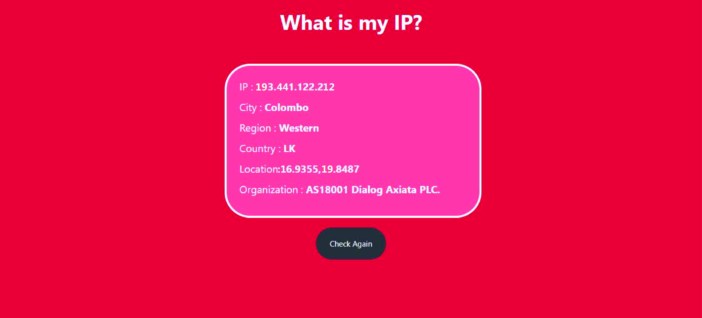

# What-is-my-IP
Check your IP address details easily 

💻😍 Online Demo : https://what-is-my-ip.netlify.app/

### Table of Content
-01 [What is this?](#What) 
-02 [For why?](#why) 
-03 [What are the technologies used?](#technologies) 
-04 [How to used this?](#How) 

## What is this?<a name="What"/>
This is a simple web app for get your current IP stats. 

## For why?<a name="why"/>
By using this web app you can get your, 
- IP address
- City
- Region 
- Country 
- Location Details (Latitude & Longitude)
- Network Organization 

## What are the technologies used?<a name="technologies"/>
- HTML
- CSS
- JavaScript
- IPinfo.io API

## How to use this?<a name="How"/>
Just give a simple touch to **Check Again** button or reload your page. Then you can get all of details about your IP address.
